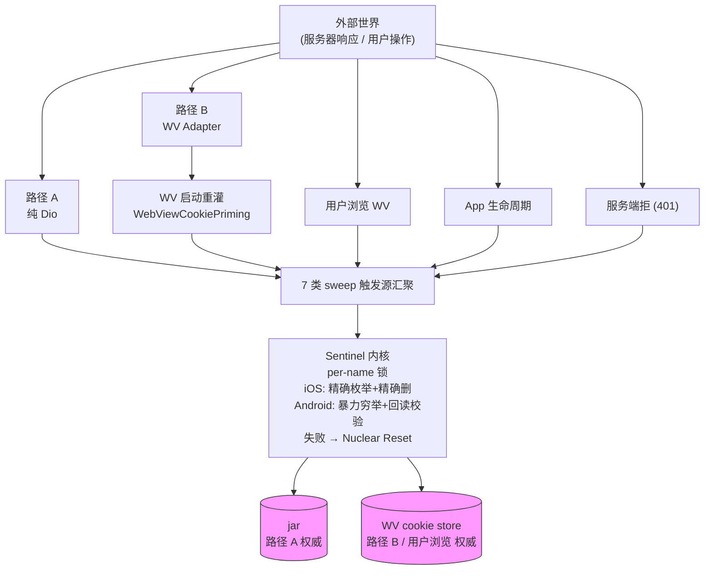
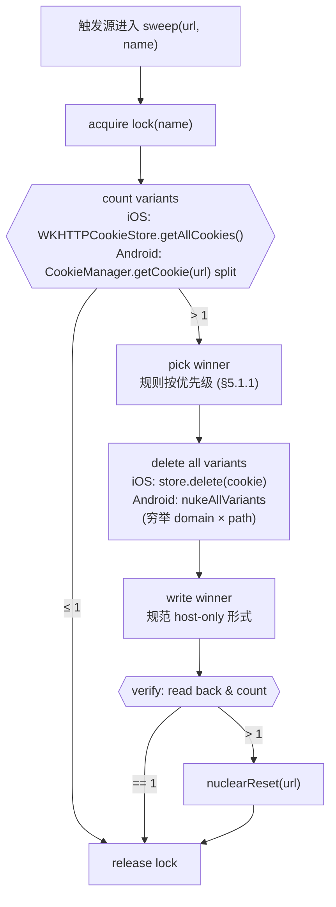
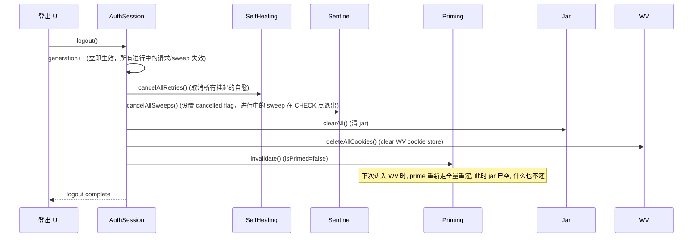
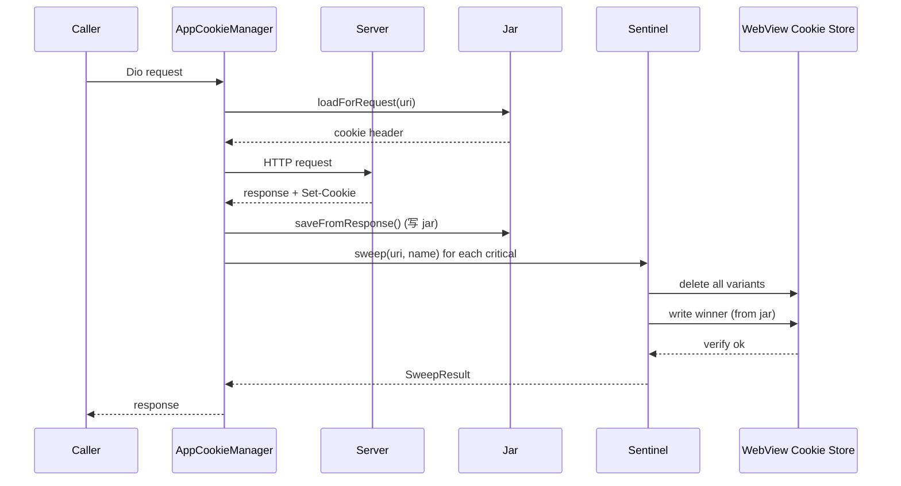
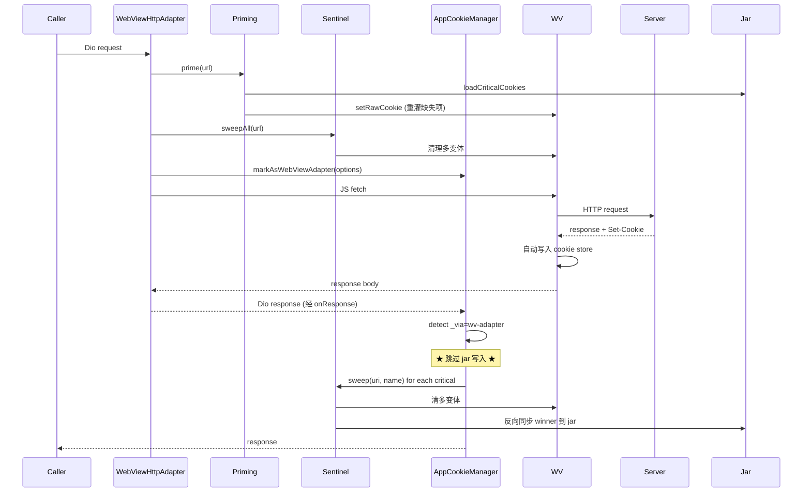
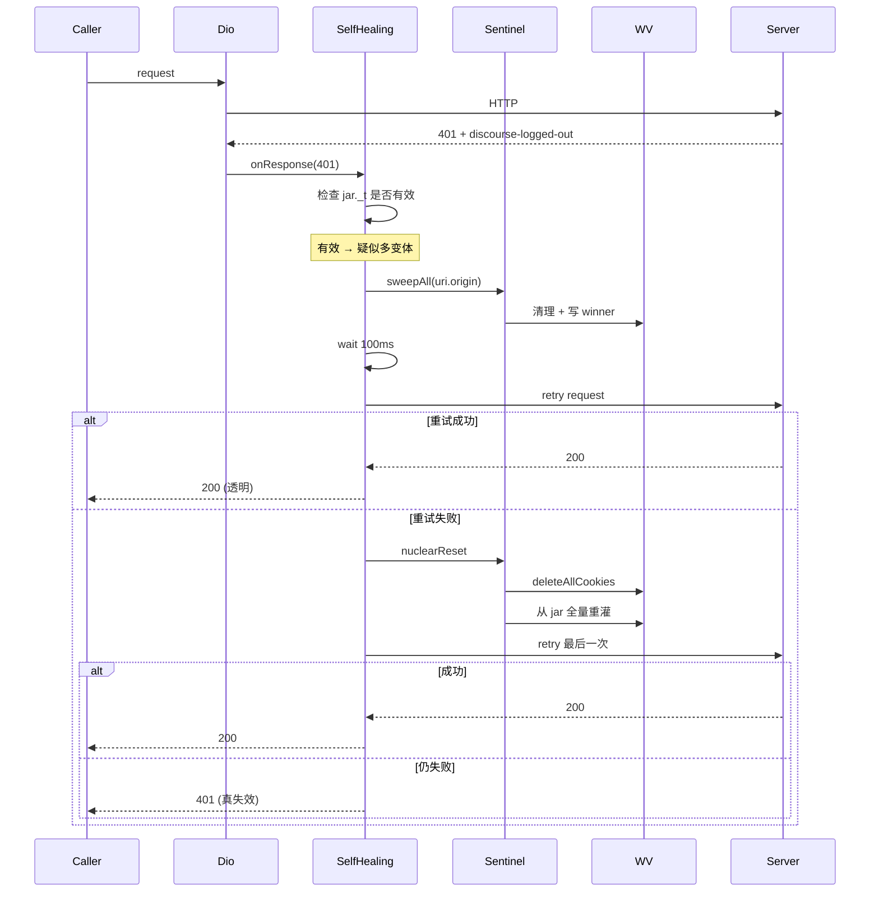
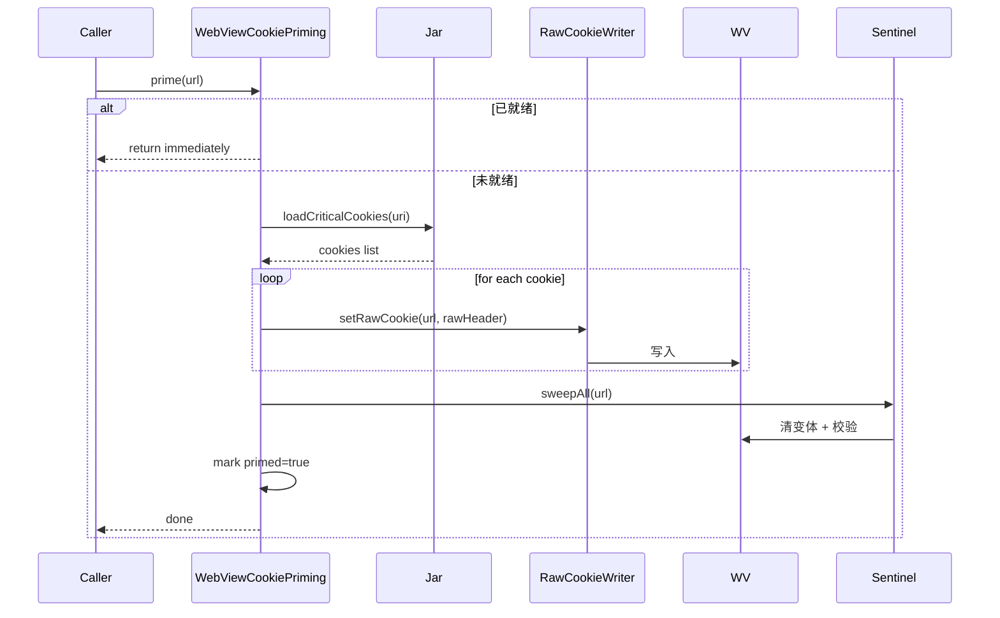

# Cookie 架构设计 v0.4.0

> 状态：设计中（未实施）
> 上一版：[v0.3.0 现状](./cookie-sync-status.md)
> 设计目标：根治多变体导致的"假登录失效"问题

---

## 0. 文档约定

### 依据等级标记

每个设计决策都标注依据来源，等级如下：

| 标记 | 含义 | 可信度 |
|------|------|--------|
| `[RFC]` | IETF RFC / 标准协议规范 | 最高 |
| `[平台]` | Apple/Google 官方 API 文档或源码 | 最高 |
| `[BUG]` | 平台官方 issue tracker 已确认 | 高 |
| `[源码]` | 第三方库源码（flutter_inappwebview / WebKit / Chromium） | 高 |
| `[社区]` | 多人实测验证的社区结论 | 中 |
| `[项目]` | 本项目代码或运行时实测 | 高（本项目内） |
| `[内部]` | 项目内部经验 / 团队约定 | 中 |
| `[待验]` | 设计假设，需在实施时实测验证 | 不可靠，必须验证 |

### 决策状态标记

| 标记 | 含义 |
|------|------|
| `[定]` | 已拍板，无争议 |
| `[选]` | 二选一/三选一，文档中已选定 |
| `[验]` | 待原生实施时实测确认 |

---

## 1. 背景

### 1.1 v0.3.0 暴露的问题

`v0.3.0` 引入 `RawSetCookieQueue` 持久化队列试图解决"打开 WebView 时 cookie 落后"问题，但实际运行中暴露三类故障：

| 故障 | 触发场景 | 根因 |
|------|----------|------|
| 假登录失效 | 用户使用过程中突然被踢出，重新进入又恢复 | WV 中 `_t` 存在多变体，服务器收到旧值的那条 |
| 推送窗口 | Dio 收到新 cookie 到 WV 看到之间有几秒延迟 | 队列是延迟 flush 模型，不是同步 |
| 修复递归 | `_repairDuplicatedSessionCookiesIfNeeded` 已在事后补救 | 队列入队/flush 两段式本身会引入新变体 |

**依据**：
- `[项目]` `lib/services/network/cookie/app_cookie_manager.dart:241-265` 主动记录 `duplicate_t_cookie_on_request` 警告日志
- `[项目]` `lib/services/network/adapters/webview_http_adapter.dart:1040-1099` `_repairDuplicatedSessionCookiesIfNeeded` 整段修复逻辑的存在本身就是证据
- `[项目]` `docs/cookie-sync-status.md` 版本历史记录 v0.2.x "多副本 bug"

### 1.2 用户底线（设计的硬约束）

> **WebView 不允许有多个相同的 cookie，否则过期 cookie 会一直导致用户登录失效。**

这一条把目标聚焦到"消除 critical cookie 在 WV 中的多变体"，所有设计决策都围绕这条底线展开。

### 1.3 Cookie identity 的正式定义

**`[RFC]` cookie identity = 4 元组 `(name, domain, path, host-only-flag)`**

依据：
- `[RFC]` [RFC 6265bis (draft-22)](https://datatracker.ietf.org/doc/draft-ietf-httpbis-rfc6265bis/) Section 5.7 Step 23：
  > If the cookie store contains a cookie with the same **name, domain, host-only-flag, and path** as the newly-created cookie...
- `[BUG]` [httpwg/http-extensions Issue #199](https://github.com/httpwg/http-extensions/issues/199) 说明这是为了匹配现代浏览器实际行为而做的修正
- `[BUG]` 原始 RFC 6265 Section 5.3 只用 3 元组 `(name, domain, path)`，与浏览器实际行为不符

**对本项目的影响**：
- 同一个 `_t` 在 WV 中可以"合法"地同时存在两条：一条 host-only（无 Domain 属性）、一条带 Domain。浏览器请求时**两条都会发送**，服务器按顺序取第一条 → 旧值生效 → 登录失效。
- Sweep 时必须按 4 元组枚举变体，而不能只看 name+domain+path。

---

## 2. 设计目标与"完美"边界

### 2.1 重新定义"完美"

由于 Android `CookieManager` 缺少精确枚举变体的能力（详见 §3.4），"WV 中变体数恒 ≤ 1"在 Android 上**物理不可达**。但"用户永远不会因多变体看到登录失效"是可达的。

| 视角 | 目标 |
|------|------|
| 状态视角 | WV 中 critical cookie 多变体的**寿命 < 1 秒** |
| 用户视角 | 用户**永远不会看到**"假登录失效"（短暂多变体被自愈机制吸收） |
| 真失效边界 | 服务器真删 session / CF 真挑战 → 提示重登（符合用户预期） |

### 2.2 三层防御

```
┌───────────────────────────────────────────────────────────────────┐
│  ① 预防层 (Prevention)                                              │
│      事前拦截：7 类 sweep 触发源，让多变体几乎不出现                 │
├───────────────────────────────────────────────────────────────────┤
│  ② 自愈层 (Self-healing)                                            │
│      事中修复：401 自愈拦截器，对用户透明地清理 + 重试                │
├───────────────────────────────────────────────────────────────────┤
│  ③ 兜底层 (Nuclear Reset)                                           │
│      事后强制：清空 WV cookie + 从 jar 全量重灌，仍失败 → 提示重登   │
└───────────────────────────────────────────────────────────────────┘
```

---

## 3. 关键技术依据

本节是整套设计的基石。每个设计决策都对应这里的一条依据。

### 3.1 iOS WKHTTPCookieStore 与 HTTPCookieStorage.shared 的同步是不可靠的

**依据**：
- `[平台]` [Apple Developer Forums thread 681239](https://developer.apple.com/forums/thread/681239) 明确："自 iOS 11.3 起，from-box 同步不可靠；仅真机有自动同步，模拟器没有；延迟 'seconds 级'"
- `[源码]` [react-native-webview Issue #1780](https://github.com/react-native-webview/react-native-webview/issues/1780) 多人实测 `sharedCookiesEnabled` 在 iOS 上行为不符合文档
- `[平台]` [Apple Developer Forums thread 95301](https://developer.apple.com/forums/thread/95301) WKWebView 网络在独立进程，HTTPCookieStorage 不可见

**设计含义**：
- iOS 上必须把两个 store 视为独立存储，不能依赖 OS 自动同步
- 写入时双写、删除时双删、读取时以 WKHTTPCookieStore 为主、HTTPCookieStorage.shared 仅在冷启动时兜底

### 3.2 WKHTTPCookieStoreObserver 不可靠且不提供 diff

**依据**：
- `[BUG]` [WebKit Bugzilla #188995](https://bugs.webkit.org/show_bug.cgi?id=188995)："iOS WKHTTPCookieStoreObserver does not consistently callback on cookie changes"
- `[平台]` [Apple Documentation: WKHTTPCookieStoreObserver](https://developer.apple.com/documentation/webkit/wkhttpcookiestoreobserver)：协议只有一个 `cookiesDidChange(in:)`，**不告诉你哪些 cookie 变了**
- `[BUG]` [Tealium-swift Issue #117](https://github.com/Tealium/tealium-swift/issues/117) 第三方 SDK 会破坏观察者
- `[平台]` [Apple Forum 100083](https://developer.apple.com/forums/thread/100083) "cookiesDidChange isn't called even after several calls to setCookie"

**设计含义**：
- 不能把 observer 作为反向同步（WV → jar）的唯一信号源
- 必须辅以多个 fallback：navigation 事件、页面 load 完成、app foreground、定时快照 diff
- 即使用 observer，也必须自己维护快照、自己计算 diff

### 3.3 Android CookieManager 的 5 条核心行为

#### 3.3.1 `setCookie + Max-Age=0` 确实删除 cookie

**依据**：
- `[平台]` [Android Developer: CookieManager](https://developer.android.com/reference/android/webkit/CookieManager) `setCookie` JavaDoc 说 "expired cookies will be ignored"，但
- `[社区]` [Qiita kawmra 实测](https://qiita.com/kawmra/items/24ac9ff3d648ac8c9aa3) 演示当前实现实际是**删除而非忽略**
- `[社区]` [Medium ericluapp](https://medium.com/@ericluapp/something-might-be-confused-about-cookiemanager-setcookie-422e6e28aacf) 多设备验证一致

**设计含义**：可以用 `Max-Age=0` 删除指定变体，但必须在删除后回读校验。

#### 3.3.2 删除变体必须 Domain 属性精确匹配

**依据**：
- `[社区]` Qiita 实测：`setCookie("...; domain=example.com; path=/")` 与 `setCookie("...; path=/")` 是**两条独立**记录，删除一条不影响另一条
- `[RFC]` RFC 6265bis Section 5.7（见 §1.3）正式说明 host-only-flag 是 identity 的一部分

**设计含义**：
- Android 上"精确删除某变体"需要传入与设置时**完全相同**的 Domain 属性（含 host-only 时不传）
- 但 Android 上**无法直接读出变体的 Domain**（见 3.3.3），所以只能穷举所有可能的 Domain 写法

#### 3.3.3 Android CookieManager 没有结构化枚举 API

**依据**：
- `[平台]` [Android Developer: CookieManager](https://developer.android.com/reference/android/webkit/CookieManager) 只提供 `getCookie(url) → String`，返回拼接字符串如 `"_t=xxx; _t=yyy"`
- `[源码]` `flutter_inappwebview` 的 Android 实现在旧设备上就是包装这个 API（详见 [docs/cookie-sync-status.md §平台 cookie 属性获取能力](./cookie-sync-status.md)）
- `[项目]` `lib/services/network/cookie/boundary_sync_service.dart:128-165` 整段 domain 兜底逻辑就是在补救这个缺陷

**设计含义**：
- 能拿到变体的**数量**（按 split 计数）和 **value**，但拿不到 **domain / path / expires / httpOnly**
- "精确删除"在 Android 上必须降级为"穷举可能 (domain, path) 组合 + 回读校验"
- Sentinel 内核必须按平台差异化实现（iOS 精确删，Android 暴力删）

#### 3.3.4 `CookieManager.flush()` 是同步阻塞 I/O

**依据**：
- `[平台]` [Microsoft Learn: CookieManager.Flush](https://learn.microsoft.com/en-us/dotnet/api/android.webkit.cookiemanager.flush)："This call will block the caller until it is done and may perform I/O"
- `[平台]` Android `CookieSyncManager` 在 API 21 起被 `flush()` 取代

**设计含义**：
- 写入后立即 flush 保证持久化，但耗时（毫秒级），不应在 UI 线程频繁调用
- Sentinel 内 sweep 操作的最后一步 flush 是有意为之的同步等待点

#### 3.3.5 Cookie 写入后内存即生效，无需 flush 即可被同进程读

**依据**：
- `[平台]` Microsoft Learn flush 文档："flush call is synchronous but not actually necessary if you just want to setup the cookies for the webview to render. This is because the webview and the cookie manager already share the same in-memory database"

**设计含义**：
- Sentinel 删变体 → 立即写 winner → 立即回读校验是可行的（无需 flush 间隔）
- flush 只在 sweep 完成后调一次，保证持久化跨进程

### 3.4 Android CDP 不可用

**依据**：
- `[内部]` 用户明确指示："Android CDP 非常不稳定，不能使用"
- `[项目]` `lib/services/network/cookie/android_cdp_feature.dart` 默认 `isEnabled = false`，印证内部经验

**设计含义**：
- Android 不依赖 CDP 任何 API（`AndroidCdpService` 在新设计中保持现状但 sweep 路径不使用）
- Android sweep 必须能在纯 `CookieManager` 上实现

### 3.5 Discourse `_t` cookie 默认是 host-only

**依据**：
- `[社区]` [Discourse Meta thread 43254](https://meta.discourse.org/t/setting-the-session-token--t-on-the-entire-domain-not-just-my-subdomain/43254) 用户报告 `_t` 设置在 `forum.example.com` 时**不会**自动发到 `example.com`，证明默认无 Domain 属性
- `[社区]` [discourse-cookie-token-domain 插件](https://github.com/mpgn/discourse-cookie-token-domain) 的存在意义就是"额外添加一条带 Domain 的 cookie"以支持跨子域 SSO
- `[RFC]` MDN Set-Cookie 文档：Domain 缺失时默认为 host-only

**设计含义**：
- Sentinel 选 winner 时优先选 host-only 变体（与服务器规范形式一致）
- 跨子域 SSO（如 `connect.linux.do`）的处理走独立通道，不与 `_t` 主路径耦合
- 重写 winner 时使用 host-only 形式

#### 3.5.1 跨子域 SSO 的 cookie 隔离

Discourse 在主域和子域（例如 `linux.do` + `connect.linux.do`）可能各自下发同名 cookie（如 `_t`）。

按 RFC 6265bis cookie identity 4 元组（§1.3）：
- `_t @ linux.do (host-only)` 和 `_t @ connect.linux.do (host-only)` 是**两条独立的 cookie**
- 它们各自有独立的生命周期，互不干扰
- 浏览器按请求 URL 的 host 匹配，host-only cookie 不跨子域发送

**设计含义**：

- Sentinel 的 sweep 按 `(url.host, name)` 维度独立维护，不跨 host 互相影响
- `connect.linux.do` 上的 `_t` 多变体由 `Sentinel.sweep("https://connect.linux.do/", "_t")` 处理
- `linux.do` 上的 `_t` 多变体由 `Sentinel.sweep("https://linux.do/", "_t")` 处理
- 两个调用进入不同的 lock（key 为 `host|name`），可并行执行
- jar 内部同样按 host 区分（jar 的 storageKey 已包含 normalizedDomain，见 [v0.3.0 文档](./cookie-sync-status.md#storagekey-设计说明)）

**例外情况**：discourse-cookie-token-domain 插件会显式下发带 `Domain=.linux.do` 的额外 cookie。这种情况：
- 该 cookie 的 host-only-flag = false，与 host-only 版本属于不同 identity
- Sentinel 视其为"非规范变体"，按 winner 规则可能保留也可能删除
- `[选]` 本设计**不主动处理跨域 SSO cookie 的语义**，将其等同于普通 cookie 处理。如未来项目接入需要跨子域 SSO，需要扩展 Sentinel 增加 host-only-flag 区分维度（按 4 元组完整 identity）

### 3.6 iOS HTTPCookie 构造方式与 host-only 关系

**依据**：
- `[平台]` [Apple Documentation: HTTPCookie init(properties:)](https://developer.apple.com/documentation/foundation/httpcookie/1392975-init) 说明：若 `.domain` 不指定，`.originURL` 是必须的，从 originURL 推断 host
- `[源码]` [swift-corelibs-foundation NSHTTPCookie.swift](https://fuchsia.googlesource.com/third_party/swift-corelibs-foundation/+/upstream/fuchsia_release/Foundation/NSHTTPCookie.swift) 实现：domain 缺省时使用 originURL.host，**不**自动加前导点 → 产生 host-only cookie
- `[平台]` 对比：`HTTPCookie.cookies(withResponseHeaderFields:for:)` 在解析 Set-Cookie 头时遵循 RFC，header 中无 Domain 属性则为 host-only

**设计含义**：
- iOS 写入 winner 时使用 `HTTPCookie(properties:)` 构造，**不传 `.domain`**，强制 host-only
- 当前代码 `ios/Runner/AppDelegate.swift:165-166` 用 `cookies(withResponseHeaderFields:for:)` 是正确的（依赖 header 内是否含 Domain），但要确保 Sentinel 写入时构造的 header **不带** Domain 属性
- `[验]` 实施时需在原生侧实测：传入只有 originURL 的 properties dict 是否真的产生 host-only cookie

### 3.7 WebView 内部网络栈会自动持久化 Set-Cookie

**依据**：
- `[平台]` WebKit / Chromium 标准行为：浏览器内的网络请求接收到 Set-Cookie 必然写入 cookie store（这是浏览器的核心职责，无法关闭）
- `[项目]` `lib/services/network/adapters/webview_http_adapter.dart` 通过 `WV.evaluateJavascript('fetch(...)')` 发请求 → 响应必然经过 WV 的网络栈 → cookie 必然被存

**设计含义**：
- 路径 B（WebViewHttpAdapter）的响应在到达 Dio 拦截器之前，**WV 已经写过一次 cookie**
- 路径 A 和路径 B 必须区分处理：路径 A 走"Dio 写 jar → sync 到 WV"；路径 B 走"WV 已写 → 反向 sync 到 jar"
- 路径 B 上**不能**再用 RawSetCookieQueue 把同一个 Set-Cookie 再写一次到 WV（这是产生变体的最大源头）

---

## 4. 架构总览

### 4.1 总架构图



### 4.2 两条 Dio 网络路径对比

| 维度 | 路径 A：纯 Dio (rhttp / 默认栈) | 路径 B：WebViewHttpAdapter |
|------|--------------------------------|--------------------------|
| 请求由谁发 | Dio 自身网络栈 | WV 的 JS `fetch()` |
| Cookie 来源 | 从 jar 拼 Cookie 头 | WV 自己从 cookie store 注入 |
| Set-Cookie 解析者 | Dio 拦截器 | WV 内部栈先解析 → 再到 Dio 拦截器 |
| Set-Cookie 自动持久化 | 否（由 Dio 拦截器写 jar） | 是（WV 网络栈自动写 cookie store） |
| 权威源 | jar | WV |
| Sentinel 写 winner 方向 | jar → WV | WV → jar |
| 设计含义 | 标准 cookie 处理流程 | **跳过 jar 写入**，从 WV 反向同步 |

**依据**：见 §3.7。

### 4.3 7 类 Sweep 触发源

| 编号 | 触发源 | 插桩位置 | 节流 |
|------|--------|----------|------|
| ① | Dio.onResponse 路径 A | `AppCookieManager.onResponse` 路径 A 分支 | 1s |
| ② | Dio.onResponse 路径 B | `AppCookieManager.onResponse` 路径 B 分支 | 1s |
| ③ | WV 导航前 | `WebViewClient.shouldOverrideUrlLoading` / `WKNavigationDelegate.decidePolicyFor` | 1s |
| ④ | WebViewHttpAdapter 发请求前 | `WebViewHttpAdapter.fetch` 入口 | 1s |
| ⑤ | WV 页面加载完成 | `onLoadStop` / `webView(_:didFinish:)` | 1s |
| ⑥ | App 回前台 | App 生命周期监听 | 不节流 |
| ⑦ | 401 自愈 | `SelfHealingInterceptor.onResponse` | **不节流（必执行）** |

---

## 5. 模块设计与接口契约

### 5.1 SessionCookieSentinel（新增·核心）

**职责**：保证 WV 中每个 critical cookie name 的变体数 ≤ 1。

```dart
class SessionCookieSentinel {
  static SessionCookieSentinel get instance;

  Future<SweepResult> sweep(
    String url,
    String name, {
    SweepIntent intent = SweepIntent.ensureUnique,
  });
  Future<List<SweepResult>> sweepAll(String url);
  Future<NuclearResetResult> nuclearReset(String url);
  Future<void> cancelAllSweeps();  // 登出时调用
  bool wasRecentlySwept(String name, {Duration within});
  Stream<SweepEvent> get events;
}

enum SweepStatus { noop, swept, nuclearReset, failed, cancelled }

enum SweepIntent {
  /// 保证唯一: 清掉多变体, 保留一个 winner
  ensureUnique,
  /// 删除: 清掉所有变体, 不重写 (服务器下发 value=del / 空值 / 已过期时使用)
  delete,
}

class SweepResult {
  final String name;
  final SweepStatus status;
  final int variantsBefore;
  final int variantsAfter;    // ensureUnique 时必然 ≤ 1; delete 时必然 == 0; 除非 failed
  final String? winnerSource; // 'jar' | 'webview' | null
  final Duration elapsed;
}
```

#### sweep(url, name, intent) 契约

| 项 | 内容 | 依据 |
|----|------|------|
| 前置 | `name ∈ criticalCookieNames` | `[定]` |
| 后置 (ensureUnique) | 返回时 WV 中该 name 的变体数 ≤ 1 | `[定]` |
| 后置 (delete) | 返回时 WV 中该 name 的变体数 == 0 | `[定]` |
| 并发 | 同一 name 全局串行（`package:synchronized` 的 `Lock`） | `[定]` |
| 不同 name | 可并行 | `[定]` |
| 幂等 (ensureUnique) | `variantsBefore ≤ 1` 时 noop 返回 | `[定]` |
| 幂等 (delete) | `variantsBefore == 0` 时 noop 返回 | `[定]` |
| 性能 | noop < 5ms；实际 sweep iOS ~20ms / Android ~80ms | `[验]` |
| 失败处理 | 升级 Nuclear Reset；仍失败抛 `CookieSweepException` | `[定]` |
| 取消 | 进行中遇到 `AuthSession.generation` 变化或 `cancelAllSweeps()` 调用，在下个 CHECK 点退出 | `[定]` |

#### intent 的判定（调用方负责）

`AppCookieManager.onResponse` 解析每条 Set-Cookie 时按以下规则决定 intent：

| 条件 | intent |
|------|--------|
| `cookie.value == 'del'`（Discourse 删除标记） | `delete` |
| `cookie.value.isEmpty` | `delete` |
| `cookie.expires != null && cookie.expires.isBefore(now)` | `delete` |
| 否则 | `ensureUnique` |

**依据**：`[项目]` `lib/services/network/cookie/app_cookie_manager.dart:399-410` 现有 `isDeletion` 判定逻辑。

#### Sentinel 内部流程



#### 5.1.1 Winner 选择规则

**iOS 路径**（能拿到完整变体信息）：

按优先级，第一条不分胜负则比下一条：

1. value 非空（依据：空 value 是删除标记或残留）
2. 未过期
3. 与 `jar.canonical` 的 value 一致（依据：jar 是 Dio 收到的最新服务器值）
4. host-only 优先（依据：见 §3.5）
5. expires 更远
6. value 字符串更长

**Android 路径**（只能拿到 value）：

降级规则：

1. 与 `jar.canonical` 的 value 一致 → 胜（最强信号）
2. value 非空 → 胜
3. value 长度更长 → 胜
4. 都没区分度 → **信 jar，直接用 jar.canonical.value 作 winner**

**关键决策 `[选]`**：Android 上 jar 永远是兜底 winner，等同于"Android 路径上 jar 是最终权威源"。

#### 5.1.2 Nuclear Reset 流程

```
1. WV.deleteAllCookies()
2. WebViewCookiePriming.invalidate()
3. WebViewCookiePriming.prime(url) → 从 jar 重灌所有 critical cookies
4. 对每个 critical name 再走一次 sweep verify
5. 仍失败 → 抛 CookieSweepException → 调用方决定是否提示用户重登
```

#### 5.1.3 AuthSession.generation 协作

现状项目用 `AuthSession().generation` 防止旧 session 的网络响应污染新 session（参见 `app_cookie_manager.dart:333-353` / `boundary_sync_service.dart:41-49`）。

**Sentinel 必须在每个关键步骤检查 generation 一致性**：

```
sweep 入口 → 记录 entryGeneration = AuthSession().generation
  ↓
acquire lock(name)
  ↓
[CHECK 1] if !AuthSession().isValid(entryGeneration) → release lock, return cancelled
  ↓
count variants
  ↓
[CHECK 2] if generation 已变化 → release lock, return cancelled
  ↓
pick winner
  ↓
delete all variants
  ↓
[CHECK 3] if generation 已变化 → release lock, return cancelled
          (此时 WV 已被清空, 接受副作用——登出本就要清 cookie)
  ↓
write winner
  ↓
verify
  ↓
release lock
```

**为什么必须检查**：
- 用户在 sweep 进行中登出 → `generation++`
- 如果 sweep 继续完成，旧 session 的 cookie 会被写入 WV → 污染新 session

**cancelled vs failed**：

| 状态 | 区别 | 后续 |
|------|------|------|
| `cancelled` | generation 不匹配主动退出 | 不触发 Nuclear Reset，不计入失败指标 |
| `failed` | 实际操作失败（写入异常、verify 不通过） | 触发 Nuclear Reset，计入告警 |

#### 5.1.4 Lock 超时与状态恢复

**默认配置**：`lockTimeout = 10 秒`。

**触发场景**：
- 原生通道死锁（罕见但理论可能）
- sweep 内部某个 await 卡死
- 跨进程同步问题（Android WebView 多进程架构）

**超时处理流程**：

```
acquire lock(name) → await timeout(10s)
  ↓
[超时未拿到锁] → 记录异常 + 上报埋点 lock_timeout_count
  ↓
检查该 name 是否有"正在执行中"的 sweep（sweepInProgress flag）
  ↓
强制释放 lock（仅当确认 sweep 已挂死）
  ↓
返回 SweepStatus.failed
  ↓
该 name 标记为 needsRecovery
  ↓
下次任意触发源进入 sweep 时, 如果 needsRecovery == true:
  → 直接走 Nuclear Reset 而不是常规 sweep
  → Nuclear Reset 成功后清 needsRecovery flag
```

**连续超时升级**：

| 连续 lock 超时次数 | 处置 |
|------------------|------|
| 1 次 | 记录，下次 sweep 走 Nuclear Reset |
| 2 次连续 | 升级告警 P1 |
| 3 次连续 | 升级告警 P0，强制 Nuclear Reset 当前 url |

**`[验]` 验证项**：超时后强制释放 lock 在 `package:synchronized` 的实际可行性（该库默认不支持外部强制释放，可能需要自己包装 `_TimeoutAwareLock`）。

### 5.2 WebViewCookiePriming（新增·WV 启动重灌）

**职责**：取代 `RawSetCookieQueue` 的"冷启动 + WV 打开时 cookie 准备"职责。

```dart
class WebViewCookiePriming {
  static WebViewCookiePriming get instance;

  Future<void> prime(String url);
  void invalidate();
  bool get isPrimed;
  Future<void> awaitReady();
}
```

#### prime(url) 契约

| 项 | 内容 | 依据 |
|----|------|------|
| 前置 | `CookieJarService.isInitialized == true` | `[定]` |
| 后置 | WV 中存在 jar 中所有未过期 critical cookies，且每个 name 变体唯一 | `[定]` |
| 幂等 | `isPrimed == true` 时立即返回 | `[定]` |
| 性能 | 已就绪 < 1ms；首次重灌 ~100-300ms | `[验]` |
| 失败处理 | 抛 `WebViewPrimingException`，上层应阻止 WV 启动 | `[定]` |

#### 调用方约束

**所有 WV 使用者必须在使用 WV 前 `await prime`**：

- `lib/pages/webview_page.dart` — 用户进入 WV 页前
- `lib/pages/webview_login_page.dart` — 登录页打开前
- `lib/services/network/adapters/webview_http_adapter.dart` — 每次 `fetch` 前
- `lib/services/cf_challenge_service.dart` — CF 验证页打开前

#### 5.2.3 启动竞态保护

**问题场景**：
- App 启动 → `main.dart` 触发 Dio 第一个请求（如刷新 token）
- 同时 `CookieJarService.initialize()` 还在异步初始化
- 同时 WV 还未创建

**保证**：

| 项 | 要求 |
|----|------|
| jar 初始化 | `CookieJarService.initialize()` 必须在 `runApp` 之前 `await` 完成 |
| Priming 容忍 jar 未就绪 | `prime()` 入口必须 `await jar.initialize()` 兜底 |
| Priming 等 WV ready | 通过 `WindowsWebViewEnvironmentService` / inappwebview 的 ready 信号 |
| 同 url 并发 prime 去重 | 所有调用进入同一个 `_primingFuture<url>` 等待 |
| 路径 A 第一个请求 | 不需要等 WV ready（路径 A 不依赖 WV） |
| 路径 B 第一个请求 | 必须等 priming 完成 |

**`[验]` 验证项**：项目 `main.dart` 中 `CookieJarService.initialize()` 的调用时机和 await 链需在实施时确认。

### 5.3 SelfHealingInterceptor（新增·Dio 拦截器）

**职责**：对路径 A 和路径 B 的 401/419 响应执行透明自愈。

```dart
class SelfHealingInterceptor extends Interceptor {
  SelfHealingInterceptor({
    required SessionCookieSentinel sentinel,
    required CookieJarService jar,
    required Dio retryDio,    // 与原 dio 同源但不含本拦截器
  });

  @override
  Future<void> onResponse(Response response, ResponseInterceptorHandler handler);
}
```

#### 自愈触发条件（全部满足）

| 条件 | 检查 | 依据 |
|------|------|------|
| 状态码 | `statusCode ∈ {401, 419}` 或 `discourse-logged-out` 头存在 | `[项目]` `app_cookie_manager.dart:413-414` 已识别此协议 |
| jar 有效 | jar 中 `_t` 存在且未过期 | `[定]` 避免对真失效用户也自愈 |
| 防递归 | `options.extra['_selfHealed'] != true` | `[定]` |
| 排除路径 | 请求不是 self-healing 重试的请求 | `[定]` |

#### Discourse mixed-signal 协议

**依据**：`[项目]` `lib/services/network/cookie/app_cookie_manager.dart:411-435` 已实现的逻辑：

```
statusCode < 400 + discourse-logged-out 头 + 不是 not_logged_in error_type
  → 矛盾信号，拦截 cookie 删除（保护现有 session）
```

自愈层复用同一判定：401 + jar 有有效 `_t` = 疑似多变体导致的服务端拒绝（不是真失效）。

#### 自愈流程

```
判定通过
   │
   ▼
1. options.extra['_selfHealed'] = true
2. await Sentinel.sweepAll(uri.origin)
3. await Future.delayed(100ms)  // 给 WV 网络栈一点时间观察新 cookie
4. retry: retryDio.fetch(options)，最多 2 次
   │
   ├─ 成功 → handler.resolve(newResponse)
   │
   └─ 全失败 ↓

5. await Sentinel.nuclearReset(uri.origin)
6. await Future.delayed(200ms)
7. retry 1 次
   │
   ├─ 成功 → handler.resolve(newResponse)
   │
   └─ 失败 → handler.next(原 response)   ★ 透传给上层，不吞 ★
```

**关键不变量**：

- 自愈对上层 Dio 透明：上层拿到的要么是真成功，要么是真失效
- 永远不会"无声把 401 变成 200"——只有 retry 真拿到 200 才返回 200
- 永远不循环自愈（`_selfHealed` 标记保护）

### 5.4 RawCookieWriter 扩展（改造）

新增 4 个原生通道方法：

```dart
class RawCookieWriter {
  // 现有
  Future<bool> setRawCookie(String url, String rawSetCookie);

  // 新增
  Future<int> nukeAllVariants({
    required String url,
    required String name,
    required List<String?> domainCandidates,
    required List<String> pathCandidates,
  });

  Future<bool> deleteExactCookie({
    required String url,
    required String name,
    required String? domain,
    required String path,
  });

  Future<List<CookieFullInfo>> getAllCookieInfos(String url);
  Future<int> countCookiesByName(String url, String name);
}
```

#### 平台支持矩阵

| 方法 | iOS | Android | Windows | Linux |
|------|-----|---------|---------|-------|
| `setRawCookie` | 现有 | 现有 | 现有 | 现有 |
| `nukeAllVariants` | 用 `getAllCookies` 过滤 + `delete` 逐条 | 用 `setCookie + Max-Age=0` 穷举组合 | CDP `Network.deleteCookies` | soup_cookie_jar |
| `deleteExactCookie` | `WKHTTPCookieStore.delete(HTTPCookie)` | 退化为 `nukeAllVariants` 单组合 | CDP | soup_cookie_jar |
| `getAllCookieInfos` | `WKHTTPCookieStore.getAllCookies` | 受限：仅 name+value，domain=null | CDP | 完整 |
| `countCookiesByName` | 基于 `getAllCookieInfos` | 基于 `getCookie(url)` split | 同上 | 同上 |

#### Linux 平台降级策略

Linux（WPE WebKit）原生 cookie API 较弱，且使用人群占比低。v0.4.0 决策：

| 维度 | Linux 策略 |
|------|------------|
| Sentinel | **禁用**（实例化时 `isSupported = false`，所有 sweep 调用直接 return `noop`） |
| Priming | **简化**：直接调 `RawCookieWriter.setRawCookie` 注入 jar 中所有 critical cookies，不做 sweep |
| 自愈层 | **保留**：401 重试机制仍生效（不依赖 Sentinel） |
| 多变体保护 | **依赖 v0.3.0 jar storageKey 去重**：jar 这层保证唯一，WV 是否多变体不强保护 |

**理由**：
- Linux 用户基数小，投入产出比低
- WPE WebKit 的 cookie API 不稳定，容易适配错误
- 后续 v0.5.0 评估是否补 Linux 原生原语

**已知风险**：Linux 用户在路径 B 上仍可能出现多变体导致的假登录失效。**接受这个降级**，通过日志监控 Linux 用户的 401 自愈触发率，若显著高于其他平台再处理。

#### Android domain 候选生成规则

`nukeAllVariants` 在 Android 上调用时，domain 候选列表由 Sentinel 构造：

```
对 url = https://linux.do/ → name = "_t":

domain 候选:
  - null            (host-only, 不传 Domain 属性)
  - "linux.do"      (与 host 相同的显式 Domain)
  - ".linux.do"     (RFC 旧式带前导点)
  - "do"            (理论 registrable domain, 但 .do 是公共后缀, 跳过)

对 url = https://connect.linux.do/ → name = "_t":

domain 候选:
  - null
  - "connect.linux.do"
  - ".connect.linux.do"
  - "linux.do"        (父域)
  - ".linux.do"       (父域带点)

path 候选:
  - "/"                   (默认, 99% 场景)
  - jar 中该 name 任何已存条目的 path (补漏)
```

**依据**：
- `[RFC]` Domain 属性的所有合法写法（host-only / 显式 host / 带前导点 / 父域）
- `[项目]` Discourse 实际只用 host-only 和 `.linux.do` 两种

### 5.5 AppCookieManager 改造（核心改动）

**职责变化**：从"统一处理 Set-Cookie"变成"按路径分流处理"。

```dart
class AppCookieManager extends Interceptor {
  static const String _viaExtraKey = '_via';
  static const String _viaAdapter = 'wv-adapter';

  static void markAsWebViewAdapter(RequestOptions options) {
    options.extra[_viaExtraKey] = _viaAdapter;
  }

  @override
  Future<void> onResponse(Response response, ResponseInterceptorHandler handler);
}
```

#### onResponse 流程（重写）

```
1. 解析 Set-Cookie headers → List<RawHeader>
2. 判别路径: isPathB = options.extra['_via'] == 'wv-adapter'

3. if 路径 A:
   3.1 写 jar (现有 saveCookies 逻辑)
   3.2 for each cookieName in Set-Cookie 中的 critical name:
       await Sentinel.sweep(uri, cookieName)
       (sweep 内部从 jar 读 winner 写 WV)
   3.3 非 critical cookies 仍走原逻辑写 jar
   3.4 handler.next(response)

4. if 路径 B:
   4.1 ★ 跳过 critical cookies 的 jar 写入 ★
       (WV 已自写, 后续从 WV 反向同步)
   4.2 for each cookieName in Set-Cookie 中的 critical name:
       await Sentinel.sweep(uri, cookieName)
       (sweep 内部从 WV 读 winner, 反向写 jar)
   4.3 非 critical cookies 仍写 jar
   4.4 handler.next(response)
```

#### 删除的现有逻辑

| 现有逻辑 | 位置 | 处置 |
|----------|------|------|
| `RawSetCookieQueue.instance.enqueue(...)` | `app_cookie_manager.dart:490` | 删除 |
| 重定向 cookie 救护 | `app_cookie_manager.dart:494-521` | 保留（与本次设计无关） |
| `_t` 多副本日志 | `app_cookie_manager.dart:241-302` | 保留（监控用） |
| mixed-signal 保护 | `app_cookie_manager.dart:411-435` | 保留（写入侧保护） |

### 5.6 WebViewHttpAdapter 简化

**接口不变，内部流程契约更新**：

```
fetch(options, requestStream):

★ 删除 ★
  - RawSetCookieQueue.instance.flushToWebView()                  (line 214)
  - _repairDuplicatedSessionCookiesIfNeeded()                    (line 215, 1040-1099)
  - _syncCookiesFromJar()                                        (line 217 兜底)

★ 新增 ★
  - await WebViewCookiePriming.prime(uri.toString())
  - await Sentinel.sweepAll(uri.toString())
  - AppCookieManager.markAsWebViewAdapter(options)

原流程：构造 JS fetch body → WV.evaluateJavascript → 解析响应
返回 ResponseBody (Dio 接管, onResponse 走路径 B)
```

**净代码变化**：删除约 200 行（队列依赖 + repair 整段方法），新增约 30 行（priming + sweep + mark）。

### 5.7 CookieJarService 改造

**删除**：
- 引入 `RawSetCookieQueue` 的所有调用（`cookie_jar_service.dart:83/290/308/325`）

**新增**：
```dart
class CookieJarService {
  // 新增
  Future<List<CanonicalCookie>> loadCriticalCookies(Uri uri);
  Future<void> saveCanonicalCookie(Uri uri, CanonicalCookie cookie); // 供 Sentinel 路径 B 反向同步
}
```

**一次性迁移**：
- 启动时检测 `.cookies/pending_set_cookies.json` 是否存在
- 存在则解析全部 raw header 写入 jar，然后删除该文件
- 使用 migration key `cookie_queue_removed_v5` 标记完成

### 5.8 登出与账号切换流程

**触发时机**：
- 用户主动登出
- 切换账号
- 服务端强制下线（自愈多次失败）
- 检测到 cookie 被外部完全清除

**完整流程**：



**关键约束**：

1. **`AuthSession.generation++` 必须最先执行**，让所有进行中的网络/sweep 操作立即作废
2. **顺序不可调换**：先清 jar 再清 WV，否则 Priming 可能在 jar 已空时被触发，把 WV 也清了又重灌（什么都灌不进去，白费 IPC）
3. **取消 sweep 不需要等其完成**，只需设置 cancelled flag，sweep 内部在 CHECK 点（见 §5.1.3）会自行退出
4. **不调用 Nuclear Reset**：登出本就是"全清"语义，与 Nuclear Reset 重复

**切换账号 = 登出 + 重新登录**：

切换账号走"登出流程 → 跳转登录页"。登录成功后：
- jar 收到新用户的 Set-Cookie
- `AppCookieManager.onResponse` 走路径 A：写 jar + sweep
- 第一次进入 WV 时 Priming 从 jar 重灌

---

## 6. 关键流程时序图

### 6.1 路径 A 时序



### 6.2 路径 B 时序（核心修正）



### 6.3 自愈时序



### 6.4 WV 启动重灌时序



---

## 7. 系统不变量

整套设计依赖以下 6 条不变量。每条不变量都有守护者，且**设计上能证明**该守护者维持该不变量。

### 不变量 1：WV 中 critical cookie 多变体寿命 < 1 秒

**守护者**：Sentinel + 7 类触发源

**证明**：
- 路径 A：onResponse 同步 await sweep，sweep 完才 next handler → 多变体寿命 = sweep 执行时间 < 100ms
- 路径 B：onResponse 同步 await sweep → 同上
- 用户浏览 WV：navigation 前 + loadStop 后都 sweep → 多变体寿命 ≤ 一次页面加载时长
- 漂移：foreground sweep + 401 自愈兜住

**例外**：服务器在两次 sweep 之间通过 WV 直接下发了新 cookie（非常罕见，且会被下次任意触发源 sweep 掉）

### 不变量 2：WV 使用前必先 Priming

**守护者**：WebViewPage / WebViewLoginPage / WebViewHttpAdapter / CfChallengeService

**强制方式**：代码 review + lint 规则（建议）

### 不变量 3：jar 中 critical cookie 永不出现多变体

**守护者**：`AppCookieManager` + `EnhancedPersistCookieJar`

**证明**：Dio 解析 Set-Cookie 时按 `(name, normalizedDomain, path)` 去重（v0.3.0 已实现，见 `cookie-sync-status.md` storageKey 设计）。jar 内部不会产生多变体。

### 不变量 4：路径 A 响应后 jar 与 WV 一致

**守护者**：`AppCookieManager.onResponse` 路径 A 分支 + Sentinel

**证明**：写 jar → sweep(winner from jar) → WV 与 jar 一致

### 不变量 5：路径 B 响应后 jar 与 WV 一致

**守护者**：`AppCookieManager.onResponse` 路径 B 分支 + Sentinel

**证明**：sweep(winner from WV) → 反向写 jar → jar 与 WV 一致

### 不变量 6：用户可见的 401 一定是真失效

**守护者**：`SelfHealingInterceptor`

**证明**：自愈层只有在"sweep + retry + nuclearReset + retry 全部失败"后才透传 401，此时服务端确实拒绝了带最新 cookie 的请求。

---

## 8. 删除清单与迁移

### 8.1 整文件删除

```
lib/services/network/cookie/raw_set_cookie_queue.dart         (232 行)
```

### 8.2 删除调用点

| 文件:行 | 内容 |
|---------|------|
| `cookie_jar_service.dart:83` | `RawSetCookieQueue.instance.initialize(...)` |
| `cookie_jar_service.dart:290` | `RawSetCookieQueue.instance.clearCookieNames({name})` |
| `cookie_jar_service.dart:308` | `RawSetCookieQueue.instance.clear()` |
| `cookie_jar_service.dart:325` | `RawSetCookieQueue.instance.clearCookieNames({name})` |
| `pages/webview_page.dart:252-253` | `RawSetCookieQueue.instance.flushToWebView()` |
| `pages/webview_login_page.dart:72` | `RawSetCookieQueue.instance.flushToWebView()` |
| `webview_http_adapter.dart:214-218` | flush + repair + syncFromJar 三段 |
| `webview_http_adapter.dart:1040-1099` | `_repairDuplicatedSessionCookiesIfNeeded` 整段方法 |
| `webview_http_adapter.dart:1064` | `RawSetCookieQueue.instance.clearCookieNames(affectedNames)` |
| `app_cookie_manager.dart:488-491` | `RawSetCookieQueue.instance.enqueue(...)` 循环 |

**实施前必须 grep 确认所有调用点**：

```bash
grep -rn "RawSetCookieQueue\|_repairDuplicatedSessionCookies\|flushToWebView" lib --include="*.dart"
```

预期表中所有条目都被找到。如果有遗漏（如未来新增的引用），本次实施必须一并删除。

### 8.3 新增文件

| 文件 | 职责 |
|------|------|
| `lib/services/network/cookie/session_cookie_sentinel.dart` | Sweep 内核 + per-name 锁 + winner 选择 |
| `lib/services/network/cookie/webview_cookie_priming.dart` | WV 启动重灌 + ready 状态管理 |
| `lib/services/network/interceptors/self_healing_interceptor.dart` | 401 自愈拦截器 |
| `lib/services/network/cookie/cookie_full_info.dart` | `CookieFullInfo` 模型（跨平台 cookie 完整描述） |

### 8.4 原生侧改造

| 平台 | 改动 |
|------|------|
| iOS (`AppDelegate.swift`) | 新增 `nukeAllVariants` / `deleteExactCookie` / `getAllCookieInfos` / `countCookiesByName` 通道；保留现有 `setRawCookie` |
| Android (`MainActivity.kt`) | 同上，但用 `CookieManager` 实现（不依赖 CDP） |
| Windows | 复用现有 CDP 通道（CDP 在 Windows 上稳定可用） |
| Linux | 待补，可暂用现有 `flutter_inappwebview` 兜底 |

### 8.5 一次性迁移

```dart
// migration_service.dart 新增
const _MIGRATION_KEY = 'cookie_queue_removed_v5';

if (!await migrationDone(_MIGRATION_KEY)) {
  final queueFile = File('${appDocDir}/.cookies/pending_set_cookies.json');
  if (await queueFile.exists()) {
    final raw = await queueFile.readAsString();
    final entries = jsonDecode(raw) as List;
    for (final entry in entries) {
      // 解析 raw Set-Cookie 头写入 jar
      final uri = Uri.parse(entry['url']);
      await jar.saveFromSetCookieHeaders(uri, [entry['raw']]);
    }
    await queueFile.delete();
  }
  await markMigrationDone(_MIGRATION_KEY);
}
```

**迁移依赖顺序**：

`cookie_queue_removed_v5` 必须在 `cookie_relaxed_key_v4` 完成后执行。`MigrationService` 应保证按顺序执行：

```dart
final migrations = <Migration>[
  CookieCleanSlateV2Migration(),
  CookieCleanSlateV3Migration(),
  AndroidNativeCdpDefaultOffV1Migration(),
  CookieRelaxedKeyV4Migration(),       // v0.3.0
  CookieQueueRemovedV5Migration(),     // v0.4.0 (新增, 依赖 v4 已完成)
];
```

**依赖原因**：如果 v5 在 v4 之前执行，jar 还没有 v4 的 storageKey 放宽，从队列文件回灌的 cookie 会被错误识别为多副本（按旧 5 元组 storageKey 包含 hostOnly），造成数据丢失。

---

## 9. 性能预算

每条路径在 sweep 实际触发时的预期延迟（不触发时 < 5ms）：

| 路径 | iOS | Android | Windows |
|------|-----|---------|---------|
| 路径 A onResponse + sweep | ~20-30ms | ~50-100ms | ~30-50ms |
| 路径 B onResponse + sweep | ~25-40ms | ~60-120ms | ~40-60ms |
| WV 启动 priming（首次） | ~100-200ms | ~150-300ms | ~150-250ms |
| WV 启动 priming（已就绪） | < 1ms | < 1ms | < 1ms |
| 401 自愈（含 retry） | ~300-600ms | ~400-800ms | ~350-700ms |
| Nuclear Reset + 重灌 | ~200-400ms | ~300-500ms | ~250-400ms |

**预算原则**：
- 路径 A/B 的 onResponse + sweep 是高频路径，必须保持在 100ms 以内
- WV 启动 priming 用户可感知（页面打开延迟），必须节流（已就绪时立即返回）
- 自愈延迟用户可感知，但比"假登录失效要求重新登录"代价小得多

---

## 10. 待实施验证清单

以下决策标注为 `[验]`，必须在原生侧实施时实测确认：

| 编号 | 验证项 | 风险等级 |
|------|--------|----------|
| V1 | iOS `HTTPCookie(properties:)` 不传 `.domain` 时确实产生 host-only cookie | 高 |
| V2 | iOS `WKHTTPCookieStore.delete(cookie)` 的 completion 是否真的代表写入已生效 | 高 |
| V3 | iOS `HTTPCookieStorage.shared` 删除同名 cookie 后,WKHTTPCookieStore 是否会被反向同步污染 | 高 |
| V4 | Android `CookieManager.setCookie(url, "name=; Max-Age=0; Domain=X")` 在主流设备上确实删除指定变体 | 高 |
| V5 | Android `CookieManager.getCookie(url)` 在多变体场景下,返回的拼接字符串顺序是否稳定 | 中 |
| V6 | Android `CookieManager.flush()` 在 5MB cookie store 上的实际耗时 | 中 |
| V7 | per-name Lock 在高频 Set-Cookie 场景（如 CF 验证）下的锁竞争是否会拖慢响应 | 中 |
| V8 | Sentinel 反向写 jar 时是否会与 Dio 的 jar.saveFromResponse 形成竞态 | 高 |
| V9 | WV 启动 priming 在已有 ~100 条非 critical cookie 的 WV 上是否仍能 < 300ms | 低 |
| V10 | 自愈 retry 后产生的新 Set-Cookie 会不会触发二次自愈（防递归检验） | 高 |
| V11 | `package:synchronized` 的 `Lock.synchronized()` 是否支持 `await` 配合 `Future.timeout`，超时后能否安全释放（如不支持，需自己包装 `_TimeoutAwareLock`） | 中 |
| V12 | `flutter_inappwebview` 在 Android 上 `cookieManager.getCookies(url:)` 的实际实现——是否就是包装 `CookieManager.getCookie()` 拆分字符串；httpOnly cookie 能否返回；返回顺序是否稳定 | 中 |
| V13 | iOS WKWebView 网络进程 (com.apple.WebKit.Networking) 与 app 进程的 cookie 操作 IPC 实际延迟——决定 SelfHealing 在 sweep 后 `wait 100ms` 是否够用，Nuclear Reset 后 `wait 200ms` 是否够用 | 中 |

**清单执行约定**：
- 实施每个模块时，对照本清单确认涉及的 V 项已验证
- 验证结果直接更新到本文档（在该行后追加"已验证 / 结论：xxx"）
- 未验证的 V 项不得进入正式 release（见 §13.4 上线 checklist）

---

## 11. 可观察性

### 11.1 现状日志体系

项目现有日志通道（新方案必须复用，不引入第三套）：

| 通道 | 用途 | 文件 |
|------|------|------|
| `CookieLogger.sync/enqueue/flush/error` | 结构化 cookie 操作日志 | `cookie_logger.dart` |
| `LogWriter.instance.write({...})` | 通用持久化日志（写 jsonl） | `log_writer.dart` |
| `debugPrint` / `AppLogger` | 控制台调试 | 各处 |

### 11.2 新增事件类型

在 `CookieLogger` 中增加方法，或在 `LogWriter` 中约定新的 `type` 值：

| 事件 type | 触发时机 | 关键字段 |
|-----------|----------|----------|
| `sweep_invoked` | sweep 入口 | url, name, intent, trigger (① ~ ⑦) |
| `sweep_noop` | variants ≤ 1 直接返回 | url, name, variantsBefore |
| `sweep_swept` | 成功清理多变体 | url, name, variantsBefore, winnerSource, elapsed |
| `sweep_failed` | sweep 失败（含 verify 失败） | url, name, reason, elapsed |
| `sweep_cancelled` | generation 不匹配取消 | url, name, entryGen, currentGen |
| `nuclear_reset_triggered` | Nuclear Reset 启动 | url, reason |
| `nuclear_reset_completed` | Nuclear Reset 完成 | url, primingDuration |
| `priming_invoked` | `Priming.prime` 入口 | url, isPrimed |
| `priming_completed` | Priming 重灌完成 | url, cookiesInjected, duration |
| `priming_failed` | Priming 失败 | url, reason |
| `self_healing_triggered` | 401 自愈触发 | url, status, jarHasValidToken |
| `self_healing_retry` | 重试动作 | url, attemptN |
| `self_healing_success` | 自愈成功 | url, attemptsUsed |
| `self_healing_failed` | 自愈最终失败 | url, attemptsUsed, finalAction |
| `lock_timeout` | Sentinel lock 超时 | name, currentHolder |

**保留现有事件（不删）**：`cookie_change` / `cookie_conflict` / `cookie_trace`

### 11.3 日志级别约定

| 事件 | 级别 |
|------|------|
| `sweep_noop` / Priming 已就绪 | debug |
| `sweep_swept` / 正常 sweep 完成 | info |
| `sweep_cancelled` / `self_healing_triggered` | info |
| `sweep_failed`（首次） | warning |
| `nuclear_reset_triggered` / `self_healing_failed` | warning |
| `lock_timeout` / `sweep_failed`（连续） | error |
| 用户真登录失效 | error |

### 11.4 DevTools service extensions (v0.4.0 已实现)

通过 `dart:developer.registerExtension` 暴露 6 类 `ext.fluxdo.cookie.*`
供 Flutter DevTools Extension (位于 `extension/devtools/`, Phase 6b 计划)
通过 vm_service 调用。

**仅在 debug / profile 模式生效**, release 模式编译期被剔除, 零开销且安全。

实现: `lib/services/network/cookie/cookie_devtools_extension.dart`
注册时机: `main.dart` 中 `CookieJarService.initialize` 后立即注册。

| service extension | 用途 | 参数 |
|-------------------|------|------|
| `ext.fluxdo.cookie.dump` | 完整快照 (jar / WV / Priming / 变体数) | `url` (可选) |
| `ext.fluxdo.cookie.sweep` | 手动触发 sweep | `url` `name` `intent` (可选, ensureUnique/delete) |
| `ext.fluxdo.cookie.nuclearReset` | 手动触发 Nuclear Reset | `url` (可选) |
| `ext.fluxdo.cookie.invalidatePriming` | 强制 Priming 重新执行 | 无 |
| `ext.fluxdo.cookie.config` | 当前配置 / 状态查询 | 无 |
| `ext.fluxdo.cookie.criticalNames` | critical cookie 名集合 | 无 |

**事件桥接**: 通过 `developer.postEvent('fluxdo.cookie.sweepEvent', payload)`
推送 SweepEvent 给 DevTool。DevTool 通过 `eventStream.where(...)` 监听。
事件类型: `SweepInvoked` / `SweepCompleted` / `SweepCancelled`。

**DevTool 端 (Phase 6b 已实现)**:

源码位置: `devtools_extension/` (独立 Flutter web app, 不参与主 app workspace)
构建产物: `extension/devtools/build/` (gitignored, 用 `tool/build_devtools_extension.sh` 生成)
注册元数据: `extension/devtools/config.yaml`

UI: 3 个 tab
- **Overview**: jar / WV cookie 双视图 + Priming 状态 + critical 变体数实时告警
  (默认 5s 自动刷新, 支持 raw JSON toggle)
- **Events**: 实时订阅 `fluxdo.cookie.sweepEvent`, 保留最近 200 条
  (按事件类型过滤, 点击查看 raw payload)
- **Actions**: 手动 sweep (含 intent 选择) / Nuclear Reset / Invalidate Priming
  (含 last result 显示)

使用方式:
```bash
./tool/build_devtools_extension.sh   # 首次/UI 改动后构建
flutter run                          # 启动主 app (debug/profile 模式)
# 启动 Flutter DevTools → 看到 Cookie tab
```

---

## 12. 测试策略

### 12.1 单元测试覆盖矩阵

| 模块 | 必测场景 | 测试位置 |
|------|----------|----------|
| `SessionCookieSentinel` | sweep noop / sweep 触发 winner / sweep verify 失败升级 Nuclear / generation cancel / lock 超时 / intent=delete | `test/services/network/cookie/session_cookie_sentinel_test.dart` |
| `WebViewCookiePriming` | 已就绪立即返回 / 首次重灌 / jar 为空 / 重灌失败 / invalidate 后重新 prime | `test/services/network/cookie/webview_cookie_priming_test.dart` |
| `SelfHealingInterceptor` | 401 触发判定 / jar 无 token 不触发 / 防递归 / retry 成功 / retry 失败升级 Nuclear / 最终失败透传 | `test/services/network/interceptors/self_healing_interceptor_test.dart` |
| Winner 选择规则 | iOS 6 条规则各自独立 / Android 3 条降级规则 / jar 一致性优先 | `test/services/network/cookie/winner_picker_test.dart` |
| `AppCookieManager` 路径分流 | 路径 A 写 jar / 路径 B 跳过 jar 写入 / 非 critical cookie 仍写 jar | `test/services/network/cookie/app_cookie_manager_test.dart` |

**Mock 方案**：
- `RawCookieWriter` mock 化（不依赖原生通道）
- `WebViewCookieStore` 用内存 map 模拟（按 4 元组索引）
- `AuthSession` 单例可控（手动 bump generation）

### 12.2 集成测试用例

| 用例 | 流程 | 验证点 |
|------|------|--------|
| INT-01 | 服务器下发 host-only + 带 Domain 两个变体的 `_t` → 用户发请求 | sweep 后 WV 中 `_t` 仅 1 条，且与 jar 一致 |
| INT-02 | Dio 路径 A 收 Set-Cookie → WV 立刻发 fetch | WV 看到的是新值，不是旧值 |
| INT-03 | Dio 路径 B 收 Set-Cookie → 不再二次 enqueue | WV cookie 不出现重复变体 |
| INT-04 | 模拟服务器返回 401 + jar 有有效 token | 自愈触发，retry 成功，上层看到 200 |
| INT-05 | 模拟服务器返回 401 + jar 无 token | 自愈不触发，401 透传 |
| INT-06 | 自愈过程中再次返回 401 | 防递归，不无限循环 |
| INT-07 | 用户登出 → 进行中的 sweep | sweep 在下个 CHECK 点 cancel |
| INT-08 | Priming 调用时 WV 未就绪 | await 至 WV ready 后继续 |
| INT-09 | 跨子域 `_t`（主域 + connect 子域）独立 sweep | 互不干扰 |
| INT-10 | 服务器下发 `_t=del` | sweep 后 WV 中 `_t` 不存在 |
| INT-11 | App 杀进程后启动 → 进入 WV | Priming 从 jar 重灌成功，登录态保持 |
| INT-12 | v0.3 用户冷启动 v0.4 (migration v5 触发) | 队列文件被解析回灌 jar 后删除, 登录态保持 |

### 12.3 故障注入

| 故障 | 注入方式 | 期望行为 |
|------|----------|----------|
| 原生通道超时 | mock 5s 后才返回 | Sentinel 触发 lock timeout 流程 |
| jar 写入失败 | mock `saveCanonicalCookie` throws | sweep 标记 failed，触发 Nuclear Reset |
| WV `deleteAllCookies` 失败 | mock 抛异常 | Nuclear Reset 失败，提示重登 |
| 自愈 retry 网络中断 | mock retry throws DioException | 进入 Nuclear Reset，再 retry 1 次 |
| 磁盘满 | mock jar 持久化失败 | jar 失败但 sweep 继续完成（WV 仍唯一） |
| App 崩溃在 sweep 中 | 进程被 kill | 下次启动 Priming 重灌恢复 |

### 12.4 性能测试

| 场景 | 指标 | 阈值 |
|------|------|------|
| sweep noop 100 次 | 平均耗时 | < 5ms |
| sweep 实际清理 100 次 | iOS 平均耗时 | < 50ms |
| sweep 实际清理 100 次 | Android 平均耗时 | < 200ms |
| Priming 重灌 50 个 cookie | iOS 平均耗时 | < 300ms |
| 自愈完整流程 | p99 | < 800ms |

### 12.5 上线前必跑

| 项 | 要求 |
|----|------|
| 单元测试 | §12.1 覆盖矩阵全过 |
| 集成测试 | §12.2 INT-01 ~ INT-12 全过 |
| 故障注入 | §12.3 6 条场景全过 |
| 性能测试 | §12.4 阈值达标 |
| 真机回归 | 至少 iOS 真机 + Android 真机各跑一遍登录 / 切账号 / CF 验证 / 长会话 |

---

## 13. 发布与监控策略

### 13.1 设计原则

| 原则 | 说明 |
|------|------|
| v0.4 单一引擎 | v0.3 (`RawSetCookieQueue` 等) 已物理删除，不维护双引擎 |
| 无 in-app 灰度 | 应用商店渠道发版后所有升级用户直接走 v0.4，不做 user-id hash 分流 |
| 无远程回退 | 没有 `cookieEngine: v03` 远程开关，出问题只能 hotfix 发版 |
| 监控驱动 | 上线后通过埋点指标观察健康度，超阈值即触发 hotfix |

**这套设计的代价**：发布后发现 v0.4 严重故障，只能等下一个 hotfix 版本通过审核（iOS App Store 通常 24-48h）。这个代价用更充分的发布前验证（§10 + §12）来对冲。

### 13.2 关键埋点指标

实施已完成。所有事件通过 `CookieLogger`（详见 §11.2）持久化到 `LogWriter`，可在线上排查时取出 jsonl 分析。

| 指标 | 定义 | 健康阈值 | 告警阈值 |
|------|------|----------|----------|
| `sweep_noop_rate` | `noop / total` | ≥ 95% | < 90% |
| `sweep_swept_rate` | `swept / total`（真清理多变体） | < 5% | > 10% |
| `sweep_variants_before_avg` | 平均触发前变体数 | ≈ 1.0 | > 1.2 |
| `sweep_failed_rate` | `failed / total` | < 0.01% | > 0.1% |
| `nuclear_reset_rate` | Nuclear Reset 触发率 | < 0.001% | > 0.01% |
| `self_healing_triggered_rate` | 401 自愈触发率 | < 0.1% | > 1% |
| `self_healing_success_rate` | 自愈成功率 | > 95% | < 85% |
| `self_healing_to_relogin_rate` | 自愈失败→真登录失效率 | < 0.01% | > 0.1% |
| `priming_failure_rate` | priming 失败率 | < 0.01% | > 0.1% |
| `lock_timeout_rate` | per-name Lock 超时率 | 0 | > 0.001% |
| `login_lost_user_report` | 用户上报"假登录失效"次数（人工统计） | 0 | > 10/天 |

### 13.3 应急流程

当任一指标超告警阈值或用户反馈集中：

1. **诊断**：拉取受影响用户的 LogWriter jsonl，按 `type=cookie_engine` 过滤
2. **判定**：根据事件序列定位失守环节（哪个 sweep 失败、自愈触发原因等）
3. **止血**：
   - 严重问题 → 紧急 hotfix 发版（针对性修复 + 提速审核）
   - 轻微问题 → 收集更多数据后规划下个版本修复
4. **复盘**：对应 §10 哪条 V 验证项未充分验证、§12 哪条测试未覆盖

### 13.4 上线前 checklist

| 项 | 状态 |
|----|------|
| §10 V1-V13 待验证清单全部完成 | □（V11 已确认；V1-V10、V12-V13 待真机验证） |
| §12.1 单元测试覆盖矩阵 | □ |
| §12.2 集成测试 INT-01 ~ INT-12 | □ |
| §12.3 故障注入清单 6 条 | □ |
| §12.4 性能预算达标 | □ |
| 真机回归测试报告 | □ |
| `dart analyze` 0 error / 0 warning（cookie 相关） | ✓ |
| 埋点接入完成（11 类事件） | ✓ |

---

## 14. 参考资料

### RFC 与标准

- [RFC 6265: HTTP State Management Mechanism](https://www.rfc-editor.org/rfc/rfc6265.html)
- [RFC 6265bis (draft-22): Cookies: HTTP State Management Mechanism](https://datatracker.ietf.org/doc/draft-ietf-httpbis-rfc6265bis/)
- [MDN: Set-Cookie header](https://developer.mozilla.org/en-US/docs/Web/HTTP/Headers/Set-Cookie)

### Apple 平台文档

- [WKHTTPCookieStore (Apple)](https://developer.apple.com/documentation/webkit/wkhttpcookiestore)
- [WKHTTPCookieStoreObserver (Apple)](https://developer.apple.com/documentation/webkit/wkhttpcookiestoreobserver)
- [HTTPCookie init(properties:) (Apple)](https://developer.apple.com/documentation/foundation/httpcookie/1392975-init)
- [HTTPCookieStorage (Apple)](https://developer.apple.com/documentation/foundation/httpcookiestorage)
- [swift-corelibs-foundation NSHTTPCookie.swift 源码](https://fuchsia.googlesource.com/third_party/swift-corelibs-foundation/+/upstream/fuchsia_release/Foundation/NSHTTPCookie.swift)

### Android 平台文档

- [Android CookieManager API](https://developer.android.com/reference/android/webkit/CookieManager)
- [Microsoft Learn: CookieManager.Flush](https://learn.microsoft.com/en-us/dotnet/api/android.webkit.cookiemanager.flush)
- [Android CookieSyncManager (废弃)](https://developer.android.com/reference/android/webkit/CookieSyncManager)

### Bug 报告与社区

- [WebKit Bugzilla #188995: iOS WKHTTPCookieStoreObserver inconsistent callbacks](https://bugs.webkit.org/show_bug.cgi?id=188995)
- [Apple Developer Forums thread 100083: WKWebView observe cookies changes](https://developer.apple.com/forums/thread/100083)
- [Apple Developer Forums thread 681239: Cookie storages sync issue](https://developer.apple.com/forums/thread/681239)
- [react-native-webview Issue #1780: NS/WK cookie sync unreliability](https://github.com/react-native-webview/react-native-webview/issues/1780)
- [Tealium-swift Issue #117: Observer stops working with third-party SDKs](https://github.com/Tealium/tealium-swift/issues/117)
- [httpwg/http-extensions Issue #199: Cookie identity 加入 host-only-flag](https://github.com/httpwg/http-extensions/issues/199)
- [Qiita kawmra: Android CookieManager 值删除/修改不能时](https://qiita.com/kawmra/items/24ac9ff3d648ac8c9aa3)
- [Medium ericluapp: Something confusing about CookieManager.setCookie](https://medium.com/@ericluapp/something-might-be-confused-about-cookiemanager-setcookie-422e6e28aacf)

### Discourse 相关

- [Discourse Meta thread 43254: Setting the session token '_t' on the entire domain](https://meta.discourse.org/t/setting-the-session-token--t-on-the-entire-domain-not-just-my-subdomain/43254)
- [discourse-cookie-token-domain plugin](https://github.com/mpgn/discourse-cookie-token-domain)

### 项目内文档

- [v0.3.0 现状文档](./cookie-sync-status.md)

---

## 附录 A：术语表

| 术语 | 定义 |
|------|------|
| critical cookie | 影响登录/会话/CF 状态的关键 cookie：`_t`, `_forum_session`, `cf_clearance` |
| 变体 (variant) | 同 name 但 `(domain, path, host-only-flag)` 之一不同的 cookie 副本 |
| host-only-flag | RFC 6265bis 定义的 cookie identity 一部分；Set-Cookie 无 Domain 属性时为 true |
| 路径 A | Dio 通过 rhttp / 默认网络栈发出的请求 |
| 路径 B | Dio 通过 WebViewHttpAdapter 由 WV JS fetch 发出的请求 |
| sweep | Sentinel 的核心操作：清理同名所有变体 + 写入唯一 winner |
| winner | sweep 后保留的那条 cookie，按规则从变体中选出 |
| Nuclear Reset | sweep 失败时的兜底：清空 WV cookie + 从 jar 全量重灌 |
| priming | WV 启动时从 jar 注入 critical cookies 到 WV 的过程 |
| 自愈 (self-healing) | 401 拦截器触发的"sweep + retry"对上层透明的恢复机制 |

## 附录 B：与 v0.3.0 的差异速查

| 维度 | v0.3.0 | v0.4.0 |
|------|--------|--------|
| 持久化队列 | `RawSetCookieQueue` + `.cookies/pending_set_cookies.json` | 删除，由 jar + Priming 取代 |
| jar → WV 推送 | 延迟 flush（队列） | 同步 sweep（per-name Lock） |
| 多变体处理 | 事后 `_repairDuplicatedSessionCookiesIfNeeded` | Sentinel 7 触发源主动预防 |
| 路径 A/B 区分 | 无显式区分 | 显式 `_via` 标记 + 分流 |
| WV 启动 | 队列 flush | `WebViewCookiePriming.prime` |
| 401 处理 | 透传上层 | `SelfHealingInterceptor` 透明自愈 |
| 失败兜底 | 无 | Nuclear Reset + 提示重登 |
| 跨平台原语 | `setRawCookie` 单一 | `setRawCookie` + `nukeAllVariants` + `deleteExactCookie` + `getAllCookieInfos` + `countCookiesByName` |
